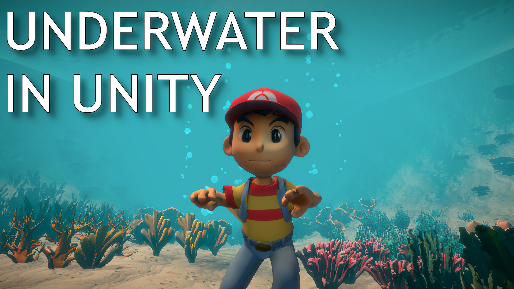

# Underwater Scene Tutorial Project

This repository accompanies a YouTube tutorial series on building an underwater exploration scene in Unity. It includes the swim-focused character controller, water/volume effects, animated vegetation, and terrain-detail tooling showcased in the videos so viewers can follow along or reuse the systems in their own projects.

## Highlights

- **Underwater Swim Controller** – Camera-relative underwater locomotion built on the Input System with terrain hugging, sprinting, and volume-aware activation.
- **Underwater Visual Suite** – Fog tinting, URP Volume blending, water surface controls, and configurable bubble particle bursts that react to submersion.
- **Sea Plant Detail Toolkit** – Custom editor tooling and shaders that convert authored plant meshes into paintable terrain details with sway animation.
- **Demo Scene** – `Assets/Scenes/Level3.unity` wires everything together: animated sea plants, volumetric water bounds, bubbles, and player rig.
- **UPM Packages** – Both the swim controller and the plant detail toolkit are structured as Unity Package Manager packages for reuse across projects.

## Requirements

- Unity 2021.3 LTS or newer (URP template recommended).
- Unity Input System (`com.unity.inputsystem`).
- Universal Render Pipeline 17.x (for the water, fog, and shader content).

## Repository Structure

| Path | Description |
| --- | --- |
| `UnderwaterSwimController/` | UPM package providing the runtime swim controller, visuals, and water volume helpers (`com.budorf.underwater-swim`). |
| `PlantDetailToolkit/` | UPM package with the plant detail importer/editor window and shaders (`com.plant.detailtoolkit`). |
| `Assets/Scenes/Level3.unity` | Main showcase scene used in the tutorial videos. |
| `Assets/Scripts/` | Project-specific MonoBehaviours (camera controller, example plant sway, etc.). |
| `Assets/Props/` | Meshes, materials, and prefabs for sea plants and set dressing. |

## Getting Started

1. Clone or download the repository.
2. Open the project in Unity 2021.3+ (URP).
3. When prompted, enable the Input System and allow Unity to recompile.
4. Open `Assets/Scenes/Level3.unity` to explore the finished demo.
5. Press Play to swim around; tweak controller settings directly on the player prefab.

## Using the Packages in Other Projects

You can install either package straight from Git using Unity Package Manager → **Add package from git URL…**

- Swim Controller: `https://github.com/mdj128/yt-underwater-scene.git?path=UnderwaterSwimController`
- Plant Detail Toolkit: `https://github.com/mdj128/yt-underwater-scene.git?path=PlantDetailToolkit`

Both packages include documentation under `Documentation~/index.md` describing setup, required inputs, and editor tooling.

## Tutorial Videos

Links to the YouTube playlist will be added once the episodes go live. Subscribe to the channel to be notified when the underwater series drops!
